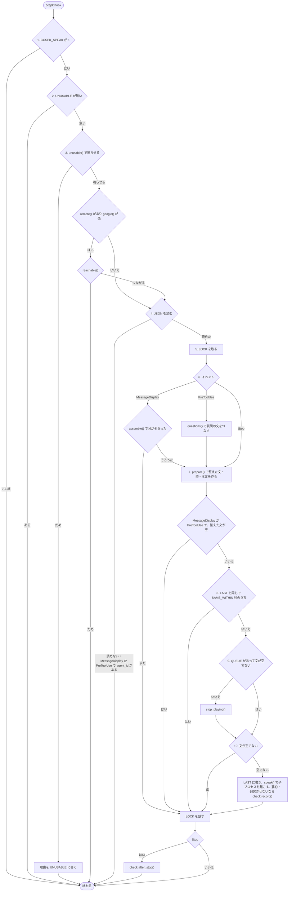
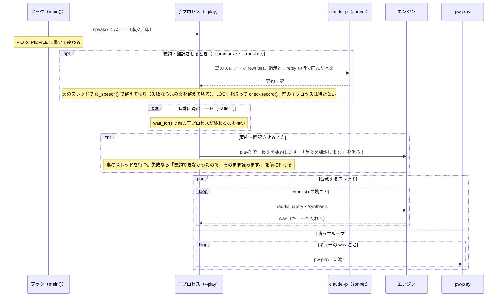
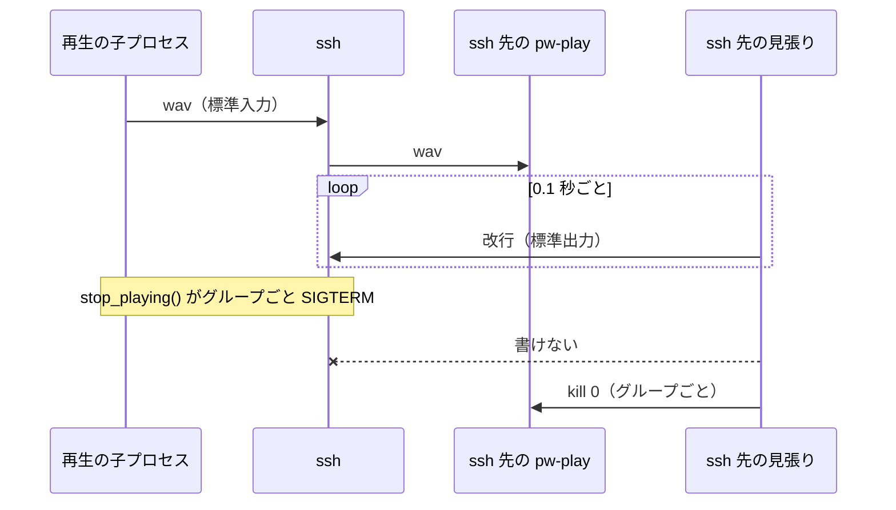
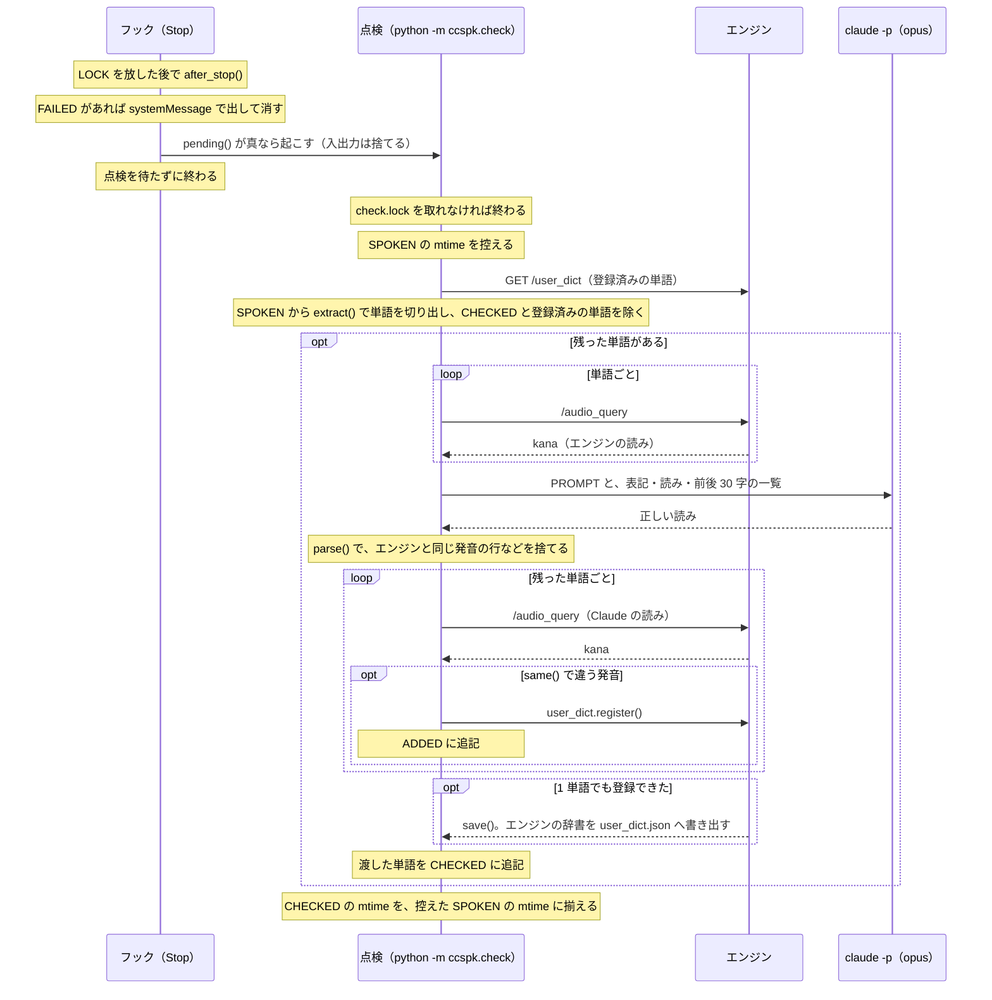

# 開発者向け

依存は click、loguru、sudachipy と sudachidict_core（自動の点検で単語を切り出す）、VOICEVOX のエンジン
（`127.0.0.1:50021`）、`pw-play`、`claude`（自動の点検で読みを判定させる。要約・翻訳を入れたときは長い返答の要約と英文の翻訳にも使う）。
読み上げの範囲や切り方など、利用者から見た動きは下の「2. 動き方」、インストールと辞書は
[UsersGuide](UsersGuide.md) にある。

## 1. ファイル

コードは `src/ccspk/` にあり、コマンド `ccspk` のサブコマンドに分かれる。

| ファイル | 中身 |
|---|---|
| `pyproject.toml` | コマンド `ccspk` の定義（`uv tool install` で入れる） |
| `src/ccspk/cli.py` | サブコマンドをまとめる。`ccspk test` もここにある |
| `src/ccspk/hook.py` | `ccspk hook`・`say`・`stop`・`status`・`summary`・`queue`・`translate`・`remote`・`engine`。Stop・MessageDisplay・PreToolUse フックとして、返答の冒頭と質問の文を VOICEVOX（か Google 翻訳の TTS）で読み上げる |
| `src/ccspk/user_dict.py` | `ccspk dict`・`speaker`・`volume`。VOICEVOX のユーザー辞書を操作する。読み上げの話者（`speaker()`）・合成の手段（`google()`）・音量（`volume()`）・ssh 先（`remote()`）もここで決める |
| `src/ccspk/check.py` | 読み間違いの自動の点検（`python -m ccspk.check`）。フックが読み上げた文を記録し、Stop で裏で起こす（[「3.8 自動の点検」](#38-自動の点検)） |
| `src/ccspk/__init__.py` | `__version__`（`--version` で出す版） |
| `src/ccspk/click_utils.py` | `--debug`・`--version` などの共通オプション |
| `src/ccspk/mylog.py` | loguru のログの設定 |
| `systemd/voicevox-engine.service` | VOICEVOX のエンジンを常駐させる user unit。起動のたびに辞書を読み込む |

## 2. 動き方

- 環境変数 `CCSPK_SPEAK` が `1` のときだけ鳴る
- 読み上げるのは整形した先頭 180 字（30 秒ほど）。超えるときは、文の途中で
  切らないよう、180 字目から 240 字目までで最初の文末まで読む。文末が無ければ
  読点まで、それも無ければ 180 字で切る。コードブロックは
  「コード省略」に置き換え、表・Markdown の記号・リンクの URL は消す
- 行の終わりには「。」を補い、見出しや箇条書きを次の行とつなげずに読む。字下げした行は、箇条書きを
  折り返した続きと見て前の行につなぐ（空行の後と、入れ子の箇条書きは除く）。空行と、句読点・「：」・英語のピリオドで終わる行
  （「（済んだ。）」のように閉じ括弧が後ろに付いても）には補わない
- 要約を入れたとき（`ccspk summary on`、または `CCSPK_SUMMARY=1`）は、整えた文が 180 字を超えたら、
  整える前の返答を `claude -p --model sonnet --effort medium` で要約させ、要約を整えて上と同じく切ってから読む。イベントは問わない。
  要約を待たずに「長文を要約します」と言い、要約を待ってから読む。要約に失敗したら、「要約できなかったので、そのまま読みます」と言ってから切った文を読む
- 翻訳を入れたとき（`ccspk translate on`）は、整える前の返答のうちコードブロックの外に、ひらがな・カタカナ・漢字が
  1 字も無ければ英文とみなし、整える前の返答（コードブロックは中身を空にする）の先頭 540 字までを `claude -p --model sonnet --effort medium` で日本語に訳させ、訳を整えて
  上と同じく切ってから読む。イベントも字数も問わないので、英語で作業すると途中の文章や質問のたびに料金がかかる。
  整えた後の文で見分けないのは、`tidy()` が足す「コード省略」「から」「TODOゼロヨンロク」などで日本語に見えてしまうため。
  要約もする長い英文は、要約で日本語にするので訳さない（`claude -p` は 1 回）。要約と同じく、先に「英文を翻訳します」と言い、訳に失敗したら「翻訳できなかったので、そのまま読みます」と言ってから切った英文を読む
- 要約と翻訳では、今日・辛い・行った・方のように文脈で読みが分かれる単語をひらがなだけで書かせる（漢字の後に括弧で読みを添えさせない。添えると二重に読むため）。
  エンジンは文脈を見ずに読みを当てるため。全部をひらがなにはさせない（エンジンが単語の切れ目を推定できず、抑揚が平板になる）
- 読み間違いを減らすため、辞書で直せないもの（記号や数字など）は置き換え、単語の読みはエンジンの辞書で直す。どちらも
  [UsersGuide.md](UsersGuide.md#2-読み上げの辞書) にある
- 文ごとに合成し（1・2 文目は下のとおり前後に切る）、最初の塊（1 文目の前半）ができたらすぐ鳴らす。
  残りは鳴らしている間に合成する。短い文の直後に長い文が来ると、継ぎ目で数秒待つことがある
- 1 文目と 2 文目はさらに前後 2 つに切る。1 文目を切るのは最初の音を早めるため、
  2 文目を切るのは継ぎ目の待ちを減らすため。切るのは 8 字より
  後ろで最初に現れる読点・閉じ括弧・コロンの後ろか、開き括弧の前。それらが
  30 字以内に無いときだけ、その手前のスペースで切り、スペースも無ければ
  30 字より後ろの区切りで切る。後半が句点だけになる所や、`12:30`・`name()` の
  ような語の中の半角「:」「(」では切らない
- 切った所は、抑揚が文末のように下がる
- 最初の音までは、エンジンが空いていれば 1.2〜2.5 秒ほど
- 返答の最後の文章に加えて、ツールを呼ぶ前などの途中の文章も読む（`MessageDisplay`）。
  ただし `MessageDisplay` が起動しない文章があり、それは読まない。起動する条件は分かっていない
- `AskUserQuestion` で質問してくるときは、質問の文を読む（`PreToolUse`）。質問が複数あれば
  全部つないで読み、選択肢は読まない
- 再生中に次の文章が来たら、前の再生を止めて新しいほうを読む。途中の文章が続けて来ると、
  前の文章は冒頭で切れる
- 順番に読むモード（`ccspk queue on`）では、前の再生を止めずに、来た順に全部読む。要約する文章が混ざっても
  順番は変わらない（後の文章の要約が先にできても、前の文章を読み終えるまで待つ）。待つ数や時間に上限は無い。
  `ccspk stop` と空の `Stop` は、鳴っている分も待っている分も全部止める
- 読んでから 5 秒のうちに同じ文章が来たら読まない。返答の最後の文章は `MessageDisplay` と
  `Stop` の両方から（実測では 0.01 秒差で）来るので、2 度読まないため
- 表だけ・URL だけのように、整えると空になる途中の文章や質問では、前の再生を止めない。
  空の `Stop` では、前の再生を止める
- サブエージェントの報告や質問では鳴らない（`SubagentStop` は登録せず、`MessageDisplay` と
  `PreToolUse` も `agent_id` があれば読まない）
- 鳴らせないとき（条件は下の [「3.4 鳴らせるかを確かめる」](#34-鳴らせるかを確かめる)）は、鳴らさずに終わり、
  使えないことを覚えて、次からは確かめもせずに終わる。
  戻し方は [UsersGuide.md](UsersGuide.md#15-読み上げが止まったままのとき) にある
- 読み上げた文を記録し、返答が終わるたびに、読み間違いを裏で点検して辞書に登録する
  （[「3.8 自動の点検」](#38-自動の点検)、[UsersGuide.md](UsersGuide.md#23-読み間違いの自動の点検)）

## 3. フックの仕組み

### 3.1 流れ

Claude Code は、返答を終えるたびに Stop フックとして、文章を表示するたびに
MessageDisplay フックとして、`AskUserQuestion` を呼ぶ直前に PreToolUse フックとして
`ccspk hook` を起動し、標準入力に JSON を渡す。
使うのは、Stop なら `last_assistant_message`（最後の返答の本文）、MessageDisplay なら
`message_id`・`index`・`delta`・`final`。MessageDisplay は 1 つの文章を `index` ごとの分
（`delta`）に分けて渡し、最後の分に `final: true` が付く。フックは並んで走り、後ろの分が
先に届くこともある。PreToolUse なら `tool_name` と `tool_input.questions[].question`。
`agent_id` があるとき（サブエージェント）は読まない。

`hook.py` にはサブコマンドが 8 つある。

| サブコマンド | 動き |
|---|---|
| `hook` | フックとして動く（下の順） |
| `say <本文>` | 合成と再生だけをする（`play()`）。子プロセスと同じ動き |
| `stop` | `LOCK` を取ってから、鳴っている再生と待っている再生を止める（`stop_playing()`）。止めたら「止めた」、鳴っていなければ「鳴っていない」と表示する。エンジンの合成は止めない |
| `status [--clear]` | `UNUSABLE` があれば理由を表示する。`--clear` なら消す |
| `summary [on\|off]` | `SUMMARY` を作る・消す。その後で `summary_on()` の結果を `on`・`off` で表示し、`CCSPK_SUMMARY` が決めていればそのことを添える |
| `queue [on\|off]` | `QUEUE` を作る・消す（`switch()`。`summary` と共通）。その後で `QUEUE` があるかを `on`・`off` で表示する |
| `translate [on\|off]` | `TRANSLATE` を作る・消す（`switch()`）。その後で `TRANSLATE` があるかを `on`・`off` で表示する |
| `engine [voicevox\|google] [--speed 倍率]` | 手段を `ENGINE_FILE` に書く（`write_config()`）。書いたら `UNUSABLE` を消す。`--speed` があれば、書いた後の手段の `speed_file()` に書く。その後で手段と `speed()` を表示する |
| `remote [HOST\|--off]` | `HOST` を `REMOTE_FILE` に書く（`write_config()`）か、`--off` で消す。どちらでも `UNUSABLE` を消す。その後で `remote()` を、無ければ `off` と表示する |

`hook.py` の `main()`（`ccspk hook`）は、フックとして次の順に進む。
どこかで条件を満たさなければ、そこで終わる。

1. 環境変数 `CCSPK_SPEAK` が `1` か
2. 使えないと覚えたファイル（`UNUSABLE`）が無いか。あれば確かめもせずに終わる
3. `unusable()` で鳴らせるかを確かめる。だめなら理由を `UNUSABLE` に書いて終わる。
   `remote()` があり `google()` が偽なら、続けて `reachable()` でエンジンにつながるかを確かめ、だめなら `UNUSABLE` に書かずに終わる
4. 標準入力の JSON を読む。MessageDisplay・PreToolUse で `agent_id` があれば終わる
5. `LOCK` を取る。ここから先は、同時に来たフックを 1 つずつ通す
6. MessageDisplay なら、`assemble()` で分を `PARTS` に置く。最後の分とそれより前の分が
   そろっていなければ終わる。そろったらつなぎ、置いた分を消す。`PARTS_KEEP` 秒より古い分もここで消す。
   PreToolUse なら、`questions()` で質問の文を改行でつなぐ。`tool_name` が
   `AskUserQuestion` でなければ空にする
7. `prepare()` で、整えた文・印・子プロセスに渡す本文の 3 つを作る。`tidy()` で整えた文が `LIMIT` を超え、`summary_on()` が
   真なら、整える前の返答（NUL は消す）を先頭 `SUMMARY_MAX` 字まで切って本文にし、要約させる印（`SUMMARIZE`）を付ける。
   そうでなく、`english()` が真（整える前の返答のコードブロックの外に、ひらがな・カタカナ・漢字が無い）で `TRANSLATE` が
   あれば、整える前の返答のコードブロックの中身を空にし（長いコードで後ろの説明がはみ出さないように）、先頭 `TRANSLATE_MAX` 字まで切って本文にし、訳させる印（`TRANSLATING`）を付ける。
   書き直させるときの整えた文は先頭 `SUMMARY_MAX` 字まで。それ以外は整えた文を `clip()` で切り（`to_speech()` と同じ）、本文も同じ。
   整えた文は、下の空かどうかと `LAST` との比べに使う（MessageDisplay と Stop で届く返答は、空白などが違うことがある）。
   MessageDisplay・PreToolUse で空になったら終わる
8. 整えた文が `LAST`（最後に読んだ文）と同じで、書いてから `SAME_WITHIN` 秒のうちなら終わる
9. `stop_playing()` で前の再生を止める。`QUEUE` があって文が空でなければ止めない
10. 文が空でなければ、`LAST` に書き、`speak()` で本文を渡して子プロセスを起こし、その PID を `PIDFILE` に書く。
    `QUEUE` があれば、`PIDFILE` にある動いている子プロセスの後ろに足す（下の「3.2 子プロセス」）。
    要約・翻訳させないときは、`check.record()` で文を記録する（[「3.8 自動の点検」](#38-自動の点検)）

`LOCK` を取った後で終わるときは、`LOCK` を放してから、Stop なら `check.after_stop()` を呼ぶ（[「3.8 自動の点検」](#38-自動の点検)）。



フックはここで終わり、Claude Code を待たせない（登録の `timeout` は 5 秒）。
合成と再生は子プロセスが受け持つ。

### 3.2 子プロセス

`speak()` は、`python -P -m ccspk.hook --play <本文>` で子プロセスを起こす（引数は `child_args()` が作り、
子プロセスでは `run_child()` が振り分ける）。
`-P` は、Claude Code の作業ディレクトリを `sys.path` に入れないため。
`start_new_session=True` で新しいセッション（兼プロセスグループ）にするので、
子プロセスが起こした `pw-play` まで、グループごと止められる。



要約させるときは `python -P -m ccspk.hook --play --summarize <本文>`（`SUMMARIZE`）、訳させるときは
`--summarize` の代わりに `--translate`（`TRANSLATING`）を付けて起こし、子プロセスは `play_rewritten()` で次の順に進む。
印ごとの指示は `PROMPTS` にある（要約は `SUMMARY_PROMPT`、翻訳は `TRANSLATE_PROMPT`）。

1. `rewrite()` を裏のスレッドで走らせる。`rewrite()` は、`claude -p --model sonnet --effort medium --setting-sources "" --tools "" --no-session-persistence <指示>` の
   標準入力に、本文を `<reply>` と `</reply>` の行で囲んで渡す。囲まないと指示と返答の境目が無く、英語の返答を
   要約する文と受け取らず「返答が含まれていない」と答えることがあった（終了コードは 0 なので失敗と見分けられない）。
   本文は整える前の返答なので、囲みが崩れないよう、中の `</reply>` は `unwrap()` で消してから渡す。
   整えてから渡さないのは、コードブロックが「コード省略」になるなど、返答の形が崩れて英文と日本語が混ざるため。
   `cwd` は `STATE`（`user_dict.py`）、環境変数は `CCSPK_SPEAK=0` を足す。
   `claude -p` は同じプロセスグループにいるので、`stop_playing()` で一緒に止まる。
   終了コードが 0 なら、出力を `to_speech()` で整えて切って返す（要約は `LIMIT` を少し超えることがある。訳は長い英文なら超える）。
   `SUMMARY_TIMEOUT` 秒で終わらない、終了コードが 0 でない、整えると空、起こせない（`OSError`）のどれかなら `""` を返す
2. 同じスレッドで、`""` か例外なら本文を `to_speech()` で整えて切った文を読む文にし、hook の `LOCK` を取って
   `check.record()` で記録する（告げる文は記録しない）。前の子プロセスを待たずに記録するので、`claude -p` が終わった後なら、待つ間に止められても記録は残る
3. 前の子プロセスを待たせる印（下の `--after=`）があれば、`wait_for()` で待つ。`claude -p` はその間も裏で進む
4. `play()` で「長文を要約します。」か「英文を翻訳します。」（`ANNOUNCE`）を鳴らす。`claude -p` を待つ間の無音を埋めるため
5. スレッドの終わりを待ち、`play()` で読む文を鳴らす。書き直せなかったときは「要約できなかったので、そのまま読みます。」か
   「翻訳できなかったので、そのまま読みます。」を前に付ける

要約・翻訳と点検（`check.py`）の `claude -p` で読み上げが起きないのは、`--setting-sources ""` で `settings.json` を読ませず、フックが登録されないから。
`settings.json` を読まないので、足した `CCSPK_SPEAK=0` もそのまま子プロセスに届く。`CCSPK_SPEAK=0` が効かないのは
`settings.json` を読む `claude -p` の場合で、`settings.json` の `env` が環境変数を上書きして `1` に戻す
（利用者向けの止め方は `docs/UsersGuide.md` の「1.3 読み上げを無効にする」）。

順番に読むモード（`QUEUE` がある）では、`speak()` は `PIDFILE` の子プロセスのうち動いているもの（`playing()`）を
止めずに残し、最後のものを `os.pidfd_open()` で開いて、その pidfd を `--after=<fd>` と `pass_fds` で新しい子プロセスに渡す
（`python -P -m ccspk.hook --play --after=<fd> [--summarize|--translate] <本文>`）。子プロセスは要約・翻訳を裏で走らせたまま、
`wait_for()` で pidfd を `select()` し、前の子プロセスが終わるのを待つ（告げるのはその後）。前の子プロセスもその前を待つので、来た順に鳴る。
PID で待たずに pidfd で待つのは、前の子プロセスが終わって番号が使い回されても、関係の無いプロセスを待たないため。
開いた後で `ours()` で確かめ、開く前に終わっていたら待たせない。`PIDFILE` には、残した PID と新しい PID を 1 行に 1 つ、
起こした順に書く。`os.pidfd_open()` が要るので、Python は 3.14 以上にしている（`uv` の 3.13 には無かった）。

`SUMMARY_PROMPT` の字数は `LIMIT` から作る。読みが分かれる単語をひらがなで書かせる指示（`KANA_NOTE`）は、
`SUMMARY_PROMPT` と `TRANSLATE_PROMPT` の両方の終わりに付ける。翻訳の切り替えは `TRANSLATE` があるかだけで決まる。要約の切り替えは `summary_on()` が決める。
環境変数 `CCSPK_SUMMARY` が `1` なら真、`0` なら偽（`summary_env()`）、ほかの値や無いときは `SUMMARY` があるか。

`play()` は、合成するスレッドと鳴らすループに分かれる。

- 合成するスレッドは、`chunks()` で分けた塊を順に `synthesize()` し、できた wav を
  キューへ入れる。何で止まっても、最後に終わりの印（`None`）を入れる
- 鳴らすループは、キューから wav を取り出し、1 つずつ `pw-play -` に渡す

1 つ目の塊ができた時点で鳴り始め、2 つ目以降は鳴らしている間に合成する。

`synthesize()` は、エンジンの `/audio_query` と `/synthesis` を続けて呼ぶ。
エンジンは要求を 1 つずつ処理し、止めた前の返答の合成も最後まで続けるので、
その後ろに並ぶと待たされる。タイムアウトを 60 秒と長めにしているのはそのため。
`/synthesis` には `enable_interrogative_upspeak=false` を渡す。渡さないと、エンジンは「？」「?」で終わる文の
語尾に、上げ調子の「ァ」を 1 音足す（「…ですか」が「…ですかぁ」と伸びて聞こえる）。

`google()`（`ccspk engine google`）が真なら、`play()` は `synthesize()` の代わりに、塊を `google_parts()` で
`GOOGLE_MAX`（200）字ずつに切り、`google_tts()` で `translate_tts` を GET する。201 字では 400 が返る。
切れ目は 200 字の中の最後の読点か空白の後ろで、無ければ 200 字ちょうど。返ってくるのは mp3 で、
`pw-play` は libsndfile で mp3 も読めるので、wav と同じく `pw-play -` に渡す。
`google()` も `speaker()` と同じく `play()` の初めに 1 回だけ読む。

速さは `user_dict.speed()` が決める。手段ごとに `speed_file()`（`ENGINE_FILE` の隣の `voicevox-speed`・`google-speed`）に
置き、無い・`SPEEDS`（0.5〜2.0）の範囲の数でないときは 1.0。`play()` の初めに 1 回だけ読む。
VOICEVOX では `synthesize()` が `/audio_query` の返す JSON の `speedScale` を書き換えて `/synthesis` に渡す。1.0 のときは JSON を読まずにそのまま渡す。
Google では `tempo()` が mp3 を `ffmpeg` の `atempo` に標準入出力で通し、wav にして返す（1 塊 35ms ほど）。
1.0 のときは `ffmpeg` を起こさず、`ffmpeg` が無い・失敗したときは元の mp3 をそのまま返す（ふつうの速さで鳴る）。

### 3.3 前の再生を止める

`stop_playing()` は `PIDFILE` の PID を全部読み、ファイルを消してから、
それぞれのプロセスグループに `SIGTERM` を送る。1 つでも動いていたら `True` を返す。再生が終わったあとで PID が別の
プロセスに使い回されていることがあるので、`/proc/<pid>/cmdline` に `--play` と
`ccspk.hook` があるときだけ送る（`ours()`。子プロセスの起こし方は上の「3.2 子プロセス」）。
後ろ（新しいほう）から送る。前から送ると、止めてから次に送るまでの間に、待っていた子プロセスが鳴り出しうる。

### 3.4 鳴らせるかを確かめる

`unusable()` は次の順に見て、最初にだめだったものの理由を返す。

1. `pw-play` が `PATH` にあるか
2. エンジンに TCP で接続できるか。HTTP では問い合わせず、接続できるかだけを見る。`google()` が真なら見ない
   （`main()` も `reachable()` を呼ばない）。Google につながるかは確かめず、つながらなければその読み上げが鳴らないだけ
3. PipeWire のソケットに接続できるか。場所は `$PIPEWIRE_RUNTIME_DIR`（無ければ
   `$XDG_RUNTIME_DIR`）の `pipewire-0`。`PIPEWIRE_REMOTE` があるときは確かめない
   （理由は [UsersGuide](UsersGuide.md#32-ccspk-hook)）

使えるときは、3 つ合わせて 1 ms ほどで終わる。

`remote()`（`ccspk remote` で決めた ssh 先）があるときは、`ssh` が `PATH` にあるかだけを見る。エンジンは
`main()` が `reachable()` で確かめる。接続できなければ `ssh -fN -o BatchMode=yes -o ConnectTimeout=3 <ホスト>` で
（最長 5 秒待って）マスター接続を張り（`~/.ssh/config` の `LocalForward` が転送を張る。すでにマスター接続があれば、それが転送を張る）、
もう一度だけ確かめる。ssh 先が一時的に落ちているだけのこともあるので、だめでも `UNUSABLE` には書かない。
代わりに `DOWN`（`ccspk.down`）に触れ、その mtime から `RETRY_AFTER`（60）秒のうちは張り直さずに終わる。
フックは Claude Code を待たせるので、落ちているあいだ毎回待たないため。つながったら `DOWN` を消す。
PipeWire は ssh 先の話なので見ない。

#### 3.4.1 ssh 先で鳴らす

`pw_play()` は、`remote()` があれば `ssh -o BatchMode=yes <ホスト> sh -c '<watched() のスクリプト>'` を返す。
ssh のクライアントを止めても（`SIGTERM` でも `SIGKILL` でも）、ssh 先の `pw-play` は鳴り続ける（2026-10-05 に実測）。
`pw-play` は標準入力の wav を読み終えていて、接続が切れたことに気づかないため。そこで `watched()` は、`pw-play` の横で
見張りを走らせる。見張りは 0.1 秒ごとに標準出力（ssh の接続）へ改行を書き、書けなくなったら `kill 0` で
プロセスグループごと止める（sshd はコマンドを新しいセッションで走らせるので、グループは `pw-play` と見張りだけ）。
`pw-play` が終われば見張りを止め、`pw-play` の終了コードで終わる。鳴り終わってから ssh が終わるまでの遅れは 0.1 秒ほど。



`save()` も、`remote()` があれば、`dump()` の出力を `ssh <ホスト> sh -c 'mkdir -p … && cat > …/user_dict.tmp && mv …'` に
渡し、ssh 先の `${XDG_CONFIG_HOME:-$HOME/.config}/ccspk/user_dict.json` を置き換える。手元の `DICT_FILE` には書かない。
送っている途中で切れても `cat` は正常に終わるので、受けた大きさが送った大きさとそろったときだけ置き換える。
裏の点検（`check.py`）からも呼ぶので、30 秒で諦める。

### 3.5 実行時のファイル

どれも `$XDG_RUNTIME_DIR` に置く。`$XDG_RUNTIME_DIR` が無い環境では `/tmp` に、
利用者の uid を名前に入れて置く。

| 定数 | 場所 | 中身 |
|---|---|---|
| `PIDFILE` | `ccspk.pid`（`/tmp/ccspk-<uid>.pid`） | 再生中と、順番を待っている子プロセスの PID。1 行に 1 つ、起こした順 |
| `UNUSABLE` | `ccspk.unusable`（`/tmp/ccspk-<uid>.unusable`） | 鳴らせない理由 |
| `LAST` | `ccspk.last`（`/tmp/ccspk-<uid>.last`） | 最後に読んだ文（整えた後） |
| `LOCK` | `ccspk.lock`（`/tmp/ccspk-<uid>.lock`） | 同時に来たフックを 1 つずつ通すためのロック。`ccspk stop` も PIDFILE を触る前に取る |
| `DOWN` | `ccspk.down`（`/tmp/ccspk-<uid>.down`） | ssh 先へマスター接続を張れなかった時刻（mtime）。`RETRY_AFTER` 秒のうちは張り直さない |
| `PARTS` | `ccspk.parts/`（`/tmp/ccspk-<uid>.parts/`） | MessageDisplay の分。`<message_id>.<index>` と、最後の分の番号を書いた `<message_id>.final` |

### 3.6 整形と分割

| 関数 | すること |
|---|---|
| `to_speech()` | `tidy()` で整え、`clip()` で切る |
| `tidy()` | コードブロックを「コード省略」に置き換え、Markdown の記号・表・URL を除き、`drop_commit_ids()` でコミット ID を消し、記号と数字の読みを整え（矢印は数字に挟まれた「→」だけ「から」、ほかは「、」に置き換える）、`end_lines()` で行の終わりに「。」を補う。字下げした行は、箇条書きの記号を消した直後に `mark_wrapped()` で印を付けておく |
| `mark_wrapped()` | 字下げした行の頭に、前の行につなぐ印（`WRAP`）を付ける。`_` や URL を消すと行頭に空白が残るので、その前に呼ぶ。つなぐのは `end_lines()`（先につなぐと、`drop_commit_ids()` が文ごと消すときに前の行まで消す） |
| `end_lines()` | 印の付いた行を前の行につなぎ、次に行が続く行の終わりに「。」を補う |
| `english()` | 整える前の返答から、コードブロック（`FENCE`）を除いて、ひらがな・カタカナ・漢字が 1 字も無ければ英文とみなす。空白だけなら偽 |
| `prepare()` | 整えた文・要約か翻訳させる印・子プロセスに渡す本文を返す。書き直させるときの本文は、整える前の返答を要約なら `SUMMARY_MAX` 字まで、翻訳ならコードブロックの中身を空にして `TRANSLATE_MAX` 字まで |
| `drop_commit_ids()` | `` ` `` で囲んだコミット ID と、カッコの中の囲まないコミット ID を消す。消すと文が壊れるものは残す |
| `clip()` | `LIMIT` 字を超えるときに、文の途中で切らないように縮める |
| `sentences()` | 文末（`ENDS`）の後ろで文に分ける |
| `split_first()` | 文を、音を早めるために前後 2 つに切る |
| `chunks()` | 合成する単位。1・2 文目は `split_first()` で切り、3 文目以降は文ごと。最後にそれぞれ `squeeze()` を通す |
| `squeeze()` | 英単語と日本語の間のスペースを詰める。`split_first()` がスペースで切るので、切った後に通す |

どこで切るかの決まりは [「2. 動き方」](#2-動き方) に、
記号や数字などの置き換えは [UsersGuide の「2.2 辞書で直せないもの」](UsersGuide.md#22-辞書で直せないもの) にある。

### 3.7 定数

| 定数 | 値 | 意味 |
|---|---|---|
| `LIMIT` | 180 | 読み上げるのはおよそここまで（字数） |
| `EXTEND` | 60 | 文末を探して延ばすのは、`LIMIT` からこの字数まで。延ばしすぎると、エンジンが 1 回の合成でメモリを使い切る |
| `ENDS` | `。！？!?` | 文末 |
| `COMMAS` | `、，` | 読点。半角の `,` は `1,000` のように数字の中にも出るので入れない |
| `ENGINE` | `http://127.0.0.1:50021` | エンジンの URL |
| `PLAY` | `--play` | 子プロセスの目印。`ours()` は `MODULE` と合わせて見分ける（`playing()`・`speak()` が使う） |
| `MODULE` | `ccspk.hook` | 子プロセスが `python -m` で起こすモジュール。`ours()` の目印にもなる |
| `FENCE` | 正規表現 | コードブロック（閉じていなければ末尾まで）。`tidy()` と `english()` で使う |
| `CUT` | 正規表現 | 1・2 文目を切る区切り |
| `CUT_MIN` | 8 | これより手前では切らない |
| `SPACE_WITHIN` | 30 | この字数までに `CUT` が無いときだけ、スペースで切る |
| `DIGITS` | `ゼロ イチ ニー …` | `TODO-` の番号と版の番号（`v1.7.0`）を桁ごとに読むカナ（0〜9） |
| `SUMMARIZE` | `--summarize` | `PLAY` の後ろに付けると、子プロセスが要約してから読む |
| `SUMMARY` | `~/.config/ccspk/summary` | あれば要約が入。`user_dict.DICT_FILE` と同じディレクトリ（`$XDG_CONFIG_HOME` に従う） |
| `QUEUE` | `~/.config/ccspk/queue` | あれば順番に読むモード。`SUMMARY` と同じディレクトリ |
| `TRANSLATE` | `~/.config/ccspk/translate` | あれば英文を訳して読む。`SUMMARY` と同じディレクトリ |
| `TRANSLATING` | `--translate` | `PLAY` の後ろに付けると、子プロセスが訳してから読む |
| `TRANSLATE_MAX` | 540（`LIMIT` の 3 倍） | 訳に回すのは先頭のこの字数まで。英文は訳すと字数が 3 分の 1 ほどになるので、訳した後で `LIMIT` 字ほどになるように |
| `AFTER` | `--after=` | `PLAY` の後ろに `--after=<fd>` と付けると、子プロセスは鳴らす前に、その pidfd の子プロセスが終わるのを待つ |
| `SUMMARY_TIMEOUT` | 30 | 要約・翻訳の `claude -p` を待つ秒数 |
| `SUMMARY_MAX` | 20000 | 要約に回すのは先頭のこの字数まで。本文は argv 1 つで渡すので、上限（131,072 バイト、日本語でおよそ 43,000 字）を超えると子プロセスを起こせない。`claude -p` に渡す量も抑える |
| `KANA_NOTE` | 文 | 文脈で読みが分かれる単語をひらがなで書かせる指示。下の 2 つの終わりに付ける |
| `SUMMARY_PROMPT` | 文 | 要約の `claude -p` に渡す指示 |
| `TRANSLATE_PROMPT` | 文 | 翻訳の `claude -p` に渡す指示 |
| `PROMPTS` | 辞書 | 子プロセスの印（`SUMMARIZE`・`TRANSLATING`）から、`claude -p` に渡す指示を引く |
| `ANNOUNCE` | 辞書 | 子プロセスの印から、読む前に告げる文（「長文を要約します。」「英文を翻訳します。」）を引く |
| `NAMES` | 辞書 | 子プロセスの印から、失敗したときに告げる文（「要約できなかったので」）の「要約」「翻訳」を引く |
| `PARTS_KEEP` | 600 | そろわないまま残った MessageDisplay の分は、この秒数で消す |
| `SAME_WITHIN` | 5 | 読んでからこの秒数のうちに同じ文が来たら読まない。長くすると、続けて同じ返答（「はい。」など）が来たときに黙ってしまう |

`ENGINE` は `user_dict.py` にもあり、`hook.py` と揃える。

話者は `user_dict.speaker()` が決める。`SPEAKER_FILE`（`~/.config/ccspk/speaker`。`ccspk speaker` が書く）の番号で、無い・数でないときは `SPEAKER`（119、夜語トバリ・明るい）。フックの子プロセスと `say` は `play()` の初めに 1 回だけ読み、`dict add --speak` と読み間違いの点検（`user_dict.query()`）は呼ぶたびに読む。`ccspk speaker` はエンジンの `/speakers` を `styles()` で (番号, 名前, スタイル) に並べ、`pick()` で引数から番号を引く。

音量は `user_dict.volume()` が決める。`VOLUME_FILE`（`~/.config/ccspk/volume`。`ccspk volume` が書く）の値で、無い・0〜1.0 の数でないときは 1.0。`pw_play()` がこれを `pw-play --volume=` に付けた引数を作る。話者と同じく、フックの子プロセスと `say` は `play()` の初めに 1 回だけ読み、`dict add --speak` は呼ぶたびに読む。`speaker`・`volume` のファイルは `write_config()` が別のファイルに書いてから置き換えるので、書いている途中に読まれても前の値で読む。

ssh 先は `user_dict.remote()` が決める。`REMOTE_FILE`（`~/.config/ccspk/remote`。`ccspk remote` が書き、`--off` で消す）のホストで、無い・空のときは `None`（手元で鳴らす）。`pw_play()`・`save()`・`unusable()` が呼ぶたびに読む（[「3.4.1 ssh 先で鳴らす」](#341-ssh-先で鳴らす)）。

### 3.8 自動の点検

`check.py` が受け持つ。フック（`hook.py` の `main()`）からは次の 2 つだけを呼び、
sudachipy は読まない（最初の音を遅らせない）。

- `record()` — `speak()` の後で、鳴らす文（`to_speech()` の結果）を `SPOKEN` に追記する。
  イベントは問わない。フックの `LOCK` を取ったまま呼ぶので、切り詰めがほかのフックとぶつからない。
  要約・翻訳させるときはフックでは呼ばず、再生の子プロセスが要約・翻訳の後で、`LOCK` を取って読む文（要約・訳、失敗したら切った文。告げる文は含めない）を
  記録する（[「3.2 子プロセス」](#32-子プロセス)）。記録は Stop より後になるので、点検は次の Stop に回る
- `after_stop()` — Stop のとき（`MessageDisplay` でも `PreToolUse` でもない）、`LOCK` を放した後で呼ぶ。
  同じ文を 2 度読まないで返るときも呼ぶ（`MessageDisplay` が記録した分があるため）。
  `FAILED` があれば中身を `{"systemMessage": …}` で標準出力に出して消す。`google()` が真なら、ここで終わる
  （エンジンが止まっていることもあるので。`SPOKEN` には溜まり続け、`voicevox` に戻した後の Stop で点検する）。`pending()` が真なら
  （`SPOKEN` があり、`CHECKED` が無いか `SPOKEN` より古いとき）、`python -P -m ccspk.check` を
  `start_new_session=True`・入出力は捨てる・`cwd` は `STATE` で起こす

`CCSPK_SPEAK` が `1` でない、`UNUSABLE` がある、`unusable()` がだめ、標準入力の JSON が読めないかオブジェクトでない、
`MessageDisplay`・`PreToolUse` に `agent_id` がある（サブエージェント）、で早く返るときは、どちらも呼ばない。
状態のファイルの読み書きの `OSError` は捨て、フックを落とさない。

点検（`main()` → `check()`）の流れ:

1. `LOCK` を `LOCK_EX | LOCK_NB` で取る。取れなければ何もせず終わる（前の点検が走っている）
2. `SPOKEN` の mtime を控えてから読み、`extract()` で単語を切り出す。英字は正規表現 `ALPHA`、
   漢字は sudachipy（sudachidict_core、`SplitMode.C`）で、品詞の先頭が名詞・漢字を含む・2 字以上のもの。
   英字のうち、版の番号（正規表現 `VERSION`。`v1.7.0`）は除く。読み方は `tidy()` が同じ `VERSION` で決める。
   sudachipy は 49,149 バイトより長い入力を断るので、1 行ずつ渡す。`CHECKED` の単語と、エンジンの辞書に
   登録済みの単語（NFKC で揃えて比べる）を除く
3. 各単語の読みを `/audio_query` の `kana` で取り、`表記<TAB>読み<TAB>最初に出てきた行の、単語の前後 30 字（around()）` の一覧を
   `claude -p --model opus --setting-sources "" --tools "" --no-session-persistence PROMPT` の標準入力に渡す。
   環境変数は `CCSPK_SPEAK=0` に上書きする。`--setting-sources ""` で利用者・プロジェクトの設定を
   読まないので、点検の `claude` のフックは走らない（`--bare` は OAuth を読まないので使えない）
4. 返答を `parse()` で読む。表記が渡した一覧に無い行、読みがカタカナ（`ァ-ヴー`）だけでない行、
   読みがエンジンの `kana` と同じ発音の行（`same()`）は捨てる。残りは、読みを `/audio_query` に通した
   `kana` でもう一度 `same()` で比べ、同じ発音なら捨てる（エンジンは長音を母音で書く。Claude は
   「セントオ」を誤りとして「セントー」を返しがち）。残りを 1 単語ずつ `user_dict.register()` で登録し（`dict add` と同じ既定）、`ADDED` に追記する。
   登録できなかった単語は飛ばして続ける。1 単語でも登録できたら、最後に 1 回 `save()` する
5. 渡した単語を全部 `CHECKED` に追記し、`CHECKED` の mtime を 2. で控えた `SPOKEN` の mtime に揃える。
   点検のあいだに足された文があれば、`SPOKEN` のほうが新しくなり、次の Stop で点検し直す

`claude -p` が終わるまでに失敗したら（例外、`claude` の終了コードが 0 でない、`TIMEOUT` 秒で終わらない、
`user_dict.call()` の `sys.exit`）、理由を `FAILED` に書いて終わり、`CHECKED` は変えない（次の Stop でやり直す）。
4. の登録や `save()` の失敗は、5. まで済ませてから、失敗した単語を `FAILED` に書く
（`claude -p` を呼び直さないため）。



`STATE` と `ADDED` は `user_dict.py` に置き、`check.py` はそれを import する（`dict auto` も `ADDED` を使う）。

`dict add`・`dict remove` は `forget_auto()` で、その単語を `ADDED` から外す。`dict auto` は `ADDED` を
一覧し、`--remove` で載っている単語を全部エンジンから消して `forget_auto()` で外す。表記を渡せば、
`auto_rows()` で選んだ単語だけを消す。

状態のファイルは `STATE`（`$XDG_STATE_HOME/ccspk`、無ければ `~/.local/state/ccspk`）に置く。
中身は [UsersGuide](UsersGuide.md#23-読み間違いの自動の点検) にもある。

| 定数 | 場所 | 中身 |
|---|---|---|
| `SPOKEN` | `spoken.txt` | 読み上げた文。1 行 1 文。`SPOKEN_MAX`（64 KiB）を超えたら後ろ半分の行だけ残す |
| `CHECKED` | `checked.txt` | 点検に回した単語。1 行 1 単語 |
| `ADDED` | `added.tsv` | 自動で登録した単語。`日時<TAB>表記<TAB>正しい読み<TAB>エンジンの元の読み` |
| `FAILED` | `failed.txt` | 点検が失敗した理由 |
| `LOCK` | `check.lock` | 点検を 1 つずつ走らせるためのロック |

| 定数 | 値 | 意味 |
|---|---|---|
| `ALPHA` | 正規表現 | 英字の単語（1 字は除く） |
| `TIMEOUT` | 300 | `claude -p` を待つ秒数 |
| `PROMPT` | 文 | `claude -p` に渡す指示 |

## 4. テストと動作の確かめ方

### 4.1 自己テスト

hook の `demo()` は、整形と分割（`to_speech`、`drop_commit_ids`、`clip`、`sentences`、`split_first`、
`chunks`、`squeeze`）、PreToolUse の質問の文を取り出す `questions()`、MessageDisplay の分をつなぐ
`assemble()`（一時ディレクトリで）、要約の切り替え（`summary_on`）、英文の見分け（`english`）、要約・翻訳させるかの分かれ目（`prepare`）、
子プロセスの振り分け（`child_args`・`run_child`。`--after=` の pidfd のプロセスが終わるまで鳴らさないことも）、子プロセスを全部止める `stop_playing()`（偽の子プロセスで。使い回された番号は触らない）と `playing()`、`switch()`、要約と翻訳（`rewrite`。`PATH` の先頭に置いた偽の `claude` で、渡す指示、失敗・空・時間切れも。
`claude` が無い例は `PATH` を一時ディレクトリだけにし、本物を起こさない）、告げる文と失敗したときの読み方（`play_rewritten`。
順番に読むモードで、`claude -p` を前の子プロセスを待つ前に走らせることも）を `assert` で確かめている（pytest ではない）。
dict の `demo()` は、アクセントの位置の決め方（`accent_of`）、全角から半角へ戻す `halfwidth`、話者の番号の引き方（`pick`）と、話者のファイルが無い・数でないときの既定（`speaker`）、音量のファイルが無い・範囲の外・数でないときの既定（`volume`・`pw_play`）、速さが手段ごとに分かれ、ファイルが無い・範囲の外・数でないときは 1.0 になること（`speed`）、ssh 先のファイルが無い・空のときと、あるときの `pw_play` の引数（`remote`）を確かめている（後の 4 つは一時ディレクトリで）。
見張り（`watched`）は手元の `sh` で、標準出力の先を閉じるとグループごと止まること、走らせたコマンドの終了コードで終わることを確かめている。
check の `demo()` は、単語の切り出し（`extract`）、`claude` の返答の読み取り（`parse`）、点検を起こす条件
（`pending`）と `SPOKEN` の切り詰め（`record`）を確かめている（後の 2 つは一時ディレクトリで）。
通れば `ok` と出る。個別に走らせる手段は無い。lint の設定は無い。

```sh
uv run ccspk test   # hook・dict・check の demo() を全部
```

整形や分割を変えたら、`demo()` に例を足す。`unusable()`・`reachable()` と `main()` の分岐は
環境に依るので、`demo()` では確かめていない。下の手順で手で確かめる。

### 4.2 フックを手で動かす

コマンドは、どれもリポジトリの直下で走らせる。`uv sync` で `.venv` に入れておき、
入れ直さずに手元のコードを試すため `.venv/bin/ccspk` を呼ぶ。

本物の `$XDG_RUNTIME_DIR` で試して `ccspk.unusable` が残ると、ファイルを
消すまで読み上げが止まる（[UsersGuide](UsersGuide.md#15-読み上げが止まったままのとき)）。
また、本物の `ccspk.pid` を使うと、そのとき鳴っている読み上げを止めてしまう。
`XDG_RUNTIME_DIR` を一時ディレクトリに向け、PipeWire の場所だけ
`PIPEWIRE_RUNTIME_DIR` で本物を指す。
読み上げた文の記録（[「3.8 自動の点検」](#38-自動の点検)）が本物に混ざらないよう、`XDG_STATE_HOME` も
一時ディレクトリに向ける。Stop として渡すと、裏で点検が起こり本物の `claude -p` を呼ぶ（料金がかかる）。
避けるなら、`PATH` の先頭に決まった行を返すだけの偽の `claude` を置く。
要約が入っていると（`ccspk summary`）、180 字を超える文でも本物の `claude -p` を呼ぶ。
`CCSPK_SUMMARY=0` を付けるか、同じく偽の `claude` を置く。翻訳が入っていると（`ccspk translate`）、英文でも本物を呼ぶ。
順番に読むモード（`ccspk queue`）は `~/.config/ccspk/queue` があるかで決まるので、利用者が入れているかで動きが変わる。
`XDG_CONFIG_HOME` も一時ディレクトリに向け、試すなら `$tmp/ccspk/queue`・`$tmp/ccspk/translate` を置く。

```sh
tmp=$(mktemp -d)
echo '{"last_assistant_message":"確認です。二つ目の文です。"}' \
  | CCSPK_SPEAK=1 XDG_RUNTIME_DIR=$tmp XDG_STATE_HOME=$tmp XDG_CONFIG_HOME=$tmp PIPEWIRE_RUNTIME_DIR=/run/user/$(id -u) \
    .venv/bin/ccspk hook
find $tmp -type f
rm -r $tmp
```

使えると判定して子プロセスを起こせば、`$tmp/ccspk.pid`・`$tmp/ccspk.last`・
`$tmp/ccspk.lock` ができる。MessageDisplay として試すなら、
`{"hook_event_name":"MessageDisplay","message_id":"m1","index":0,"final":true,"delta":"…"}` を渡す
（`$tmp/ccspk.parts/` もできる）。PreToolUse として試すなら、
`{"hook_event_name":"PreToolUse","tool_name":"AskUserQuestion","tool_input":{"questions":[{"question":"…"}]}}` を渡す。5 秒のうちに同じ文を渡すと、`ccspk.pid` の中身は
変わらない（2 度読まない）。JSON に `\n` を入れるときは、zsh の `echo` は改行に変えてしまうので
`printf '%s'` で渡す。
使えないと判定したときは、`$tmp/ccspk.unusable` ができ、中身が理由になる。

`pw-play` が無いときを再現するなら、別の一時ディレクトリで、`PATH` を空にする。
`.venv/bin/ccspk` は Python を絶対パスで呼ぶので、`PATH` が空でも動く。

```sh
tmp=$(mktemp -d)
echo '{"last_assistant_message":"確認です。"}' \
  | CCSPK_SPEAK=1 XDG_RUNTIME_DIR=$tmp PATH=/nonexistent .venv/bin/ccspk hook
XDG_RUNTIME_DIR=$tmp .venv/bin/ccspk status   # pw-play が無い
rm -r $tmp
```

子プロセスは出力を捨てるので、PID のファイルができたのに鳴らないときは、
子プロセスを直接起動して、合成と再生だけを試す（整形は通らない）。

```sh
.venv/bin/ccspk say '合成と再生だけを試す。'
```

### 4.3 最初の音までの時間

フックを起動してから、子プロセスのグループに `pw-play` が現れるまでを測る。
上と同じく一時ディレクトリで動かす。エンジンが前の合成を続けていると、その分
遅くなるので、読み上げが鳴っていないときに測る。

```sh
python3 - <<'PY'
import json, os, subprocess, tempfile, time
from pathlib import Path

tmp = tempfile.mkdtemp()
env = {**os.environ, "CCSPK_SPEAK": "1", "XDG_RUNTIME_DIR": tmp, "XDG_STATE_HOME": tmp,
       "PIPEWIRE_RUNTIME_DIR": f"/run/user/{os.getuid()}"}
t0 = time.monotonic()
subprocess.run([".venv/bin/ccspk", "hook"], text=True, env=env, check=True,
               input=json.dumps({"last_assistant_message": "最初の音までを測る、短い文です。"}))
pid = Path(tmp, "ccspk.pid")
if not pid.exists():
    raise SystemExit(Path(tmp, "ccspk.unusable").read_text())
pgid = pid.read_text()
while subprocess.run(["pgrep", "-g", pgid, "-x", "pw-play"], stdout=subprocess.DEVNULL).returncode:
    if time.monotonic() - t0 > 60:
        raise SystemExit("60 秒たっても鳴らない")
    time.sleep(0.01)
print(f"{time.monotonic() - t0:.2f} 秒")
PY
```

目安は [「2. 動き方」](#2-動き方) にある。
