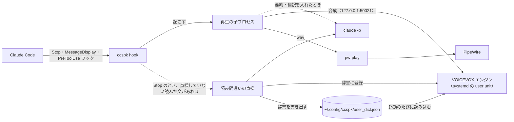

# 使い方

Claude Code が返答や質問を出すたびにフックで `ccspk hook` を起こし、`ccspk` が VOICEVOX エンジンで合成した音を
`pw-play` で PipeWire に流す。



## 1. インストール

リポジトリは `~/work/ccspk` に clone する（下の手順のコマンドは、
このパスを前提にしている）。コマンド `ccspk` は `uv tool install` でインストールする。

```sh
git clone git@github.com:ytani01/ccspk.git ~/work/ccspk
uv tool install ~/work/ccspk
```

コードを直したら、`uv tool install --reinstall ~/work/ccspk` で再インストールする。

### 1.1 VOICEVOX エンジン

エンジンは公式リリースの Linux 単体版を使う（約 1.8 GB、展開後 2.2 GB）。
夜語トバリは 0.25.2 からなので、AUR の `voicevox-engine`（0.24.1）では使えない。
`.vvpp` の中身は zip で、`7z` で展開できる。

```sh
mkdir -p ~/.local/share/voicevox-engine && cd ~/.local/share/voicevox-engine
gh release download 0.25.2 -R VOICEVOX/voicevox_engine \
  -p 'voicevox_engine-linux-cpu-x64-0.25.2.vvpp'
7z x -o0.25.2 voicevox_engine-linux-cpu-x64-0.25.2.vvpp
chmod +x 0.25.2/run
rm voicevox_engine-linux-cpu-x64-0.25.2.vvpp
systemctl --user link ~/work/ccspk/systemd/voicevox-engine.service
systemctl --user enable --now voicevox-engine.service
curl -s http://127.0.0.1:50021/version   # "0.25.2" が返れば起動している
```

再生には `pw-play`（PipeWire）を使う。バージョンを上げるときは、展開先と
unit ファイルのパスを揃えて書き換え、`systemctl --user daemon-reload` してから
再起動する。

エンジンが起動するたびに、`~/.config/ccspk/user_dict.json` があれば辞書に読み込む
（unit ファイルの `ExecStartPost`。`~/.local/bin/ccspk` を使うので、先に `ccspk` を
インストールしておく）。詳しくは [辞書のファイル](#21-辞書のファイル)。

整形が正しく動くかは [`ccspk test`](#310-ccspk-test) で確認できる。

### 1.2 Claude Code の設定

`~/.claude/settings.json` の `hooks` に Stop・MessageDisplay・PreToolUse のフックを追加し、
`env` で `CCSPK_SPEAK` を `1` にする。どのフックで何を読むかは [`ccspk hook`](#32-ccspk-hook)。
途中の文章や質問が要らなければ、MessageDisplay や PreToolUse のフックは追加しない。
フックのコマンド（`! command -v ccspk >/dev/null || ccspk hook`）は、`ccspk` をインストールしていないマシンでは
何もせずに終わる。
`ccspk` は `PATH` から探すので、インストールしたのに音が出ないときは、Claude Code を
起動するシェルで `command -v ccspk` が見つかるかを確認する。

```json
"env": {
  "CCSPK_SPEAK": "1"
},
"hooks": {
  "Stop": [
    {
      "hooks": [
        {
          "type": "command",
          "command": "! command -v ccspk >/dev/null || ccspk hook",
          "timeout": 5
        }
      ]
    }
  ],
  "MessageDisplay": [
    {
      "hooks": [
        {
          "type": "command",
          "command": "! command -v ccspk >/dev/null || ccspk hook",
          "timeout": 5
        }
      ]
    }
  ],
  "PreToolUse": [
    {
      "matcher": "AskUserQuestion",
      "hooks": [
        {
          "type": "command",
          "command": "! command -v ccspk >/dev/null || ccspk hook",
          "timeout": 5
        }
      ]
    }
  ]
}
```

### 1.3 読み上げを無効にする

`env` の `CCSPK_SPEAK` の行を消す。フックの登録は残してよい
（何もせずに終わる）。[読み間違いの自動の点検](#23-読み間違いの自動の点検)も止まる。

### 1.4 鳴っている読み上げを止める

Claude Code で Esc を押して返答を中断しても、読み上げは止まらない。止めるときは
[`ccspk stop`](#34-ccspk-stop) を実行する。

### 1.5 読み上げが止まったままのとき

フックは、鳴らせないと分かると理由をファイルに記録し、そのファイルがあるあいだは
読み上げずに終わる（[`ccspk hook`](#32-ccspk-hook)）。エンジンを一時的に止めたときや、
ログイン直後にエンジンが起動し終わる前に返答が来たときも記録される。

1. `ccspk status` で理由を見る（[`ccspk status`](#35-ccspk-status)）
2. 原因を取り除く
3. `ccspk status --clear` でファイルを消す。次の返答から、フックがまた確認する

### 1.6 長い返答を要約して読む

読み上げるのは整えた文の冒頭 180 字ほどで、超える分は読まない。`ccspk summary on` にすると、
180 字を超える返答は、Claude（Sonnet）に 180 字ほどに要約させてから読む（[`ccspk summary`](#36-ccspk-summary)）。
既定は切ってある。要約する返答では、最初の音が 5〜6 秒ほど遅れ、1 回に入力 約 8,000・出力 約 150 トークンを使う。

### 1.7 前の読み上げを止めずに順番に読む

読み上げの途中で次の文章が来ると、前の読み上げを止めて新しいほうを読む。`ccspk queue on` にすると、
前の読み上げを止めずに、来た順に全部読む（[`ccspk queue`](#37-ccspk-queue)）。既定は切ってある。

### 1.8 英文の返答を訳して読む

英文の返答は、日本語の話者が英語を読むので聞き取りにくい。`ccspk translate on` にすると、英文の返答は
Claude（Sonnet）に日本語へ訳させてから読む（[`ccspk translate`](#38-ccspk-translate)）。既定は切ってある。
訳す返答では、最初の音が 5 秒ほど遅れ、1 回に入力 3,000〜6,500・出力 約 250 トークンを使う。返答の最後の文章だけでなく、
途中の文章や質問も訳すので、英語で作業するとそのたびに使う。

### 1.9 話者を変える

読み上げの話者は、既定では夜語トバリ（明るい、119）。`ccspk speaker --list` でエンジンの話者を一覧し、
`ccspk speaker 3` か `ccspk speaker ずんだもん ノーマル` のように決める（[`ccspk speaker`](#39-ccspk-speaker)）。

## 2. 読み上げの辞書

返答の読み上げで読み間違える単語は、VOICEVOX のエンジンのユーザー辞書で読みを直す。
操作はどれも [`ccspk dict`](#311-ccspk-dict) のサブコマンドで行う。

1. `ccspk dict kana` で、エンジンが今どう読むかを確認する
2. `ccspk dict add` で表記と読みを登録する。登録後の読みが表示される
3. アクセントが違えば `--accent` で、エンジン標準の読みに負けるなら `--priority` で指定して
   登録し直す
4. 登録した単語は `ccspk dict list` で一覧し、要らなくなったら `ccspk dict remove` で消す

```sh
ccspk dict kana 'README を直す'
ccspk dict add README リードミー --speak
```

### 2.1 辞書のファイル

辞書のファイルは `~/.config/ccspk/user_dict.json`（`$XDG_CONFIG_HOME` があれば
`$XDG_CONFIG_HOME/ccspk/user_dict.json`）。表記は半角で書く。

- `dict add`・`dict remove`・`dict import`・`dict auto --remove` が成功すると、エンジンの辞書をこのファイルへ
  書き出す。手で書き出す必要は無い
- エンジンが起動するたびに、このファイルを `dict import` で読み込む。エンジンの版を上げたり
  入れ直したりしても、辞書は戻る。エンジンが 10 秒で応答しないときは読み込まずに
  あきらめる（エンジンは止めない）。そのときは `journalctl --user -u voicevox-engine` で理由を見る
- 別のマシンへは、このファイルを写してからエンジンを再起動する（または `dict import` する）

### 2.2 辞書で直せないもの

辞書で直せないものは、`src/ccspk/hook.py` で置き換えている。

- 「〜」「～」「→」は「から」にする。前後のスペースも消す（`1 〜 4` → `1から4`）
- 半角の「~」は、数字に挟まれたときだけ「から」にする（`1~4` → `1から4`）
- 「・」は「、」にする。エンジンは数字に挟まれた「・」を小数点と読むため（`1・3・4` が「1.3、4」になる）。
  ほかの所の「・」も「、」と同じ間で読むので、すべて置き換える。前後のスペースも消す
- 数字の直後のスペースは、同じ行で日本語の文字が続くときだけ消す
  （`180 字` → `180字`）。全角数字も同じ
- `TODO-` に続く番号は、桁ごとのカナにする（`TODO-027` → `TODOゼロニーナナ`）。2・5 は
  「ニー」「ゴー」と読む。直後の「〜」「～」「~」「→」に続く番号も同じ
  （`TODO-020〜022` → `TODOゼロニーゼロからゼロニーニー`）。`PR-12` のような、ほかの「英字-数字」は変えない
- 英単語と日本語の間のスペースは詰める（`同じ reviewer に` → `同じreviewerに`）。スペースの前後に
  間が入るため。英単語同士（`Claude Code`）と、数字の前（`手順 1`）の
  スペースは残す（数字の直後は上のとおり）。長い文をスペースで切ることがあるので、詰めるのは合成する単位に切った後（`chunks`）。
  切るのに使ったスペースの所には間が残る
- コミット ID は読まない。`` ` `` で囲んだ小文字の 16 進 7 桁（`` `596eeac..4cbdc8c` `` の範囲も）を
  コミット ID と見る。8 桁は含めない
  - ID だけ消す: `` コミットしました（`0b7c291`）。 `` → `コミットしました。`、
    `` （`773c552`、push はしていません） `` → `（push はしていません）`、
    `` `b54297d` でコミットしました `` → `コミットしました`（「で」「に」「として」も消す）
  - 件名が続くもの（`` `343f827` feat(bin): … ``、`` `eb0763a feat(ghostty): …` ``）は件名だけ読む
  - ID のほかに中身が無い文は文ごと消す: `` コミットは `d774e35` です。 ``、`` 最新のコミット: `a1a9b44`。 ``。
    「、」を含む文は消さない
  - 消すと文が壊れるものは読む: `` `fd36df8` に注釈付きタグを付けました ``、`` `a1a9b44` より前の 5 件 ``

### 2.3 読み間違いの自動の点検

読み上げた文から単語を切り出し、読み間違いを Claude（Opus）に判定させて、誤りは辞書に登録する。
確認は挟まない。登録した単語は [`ccspk dict auto`](#316-ccspk-dict-auto) で見直し、まとめて消せる。

- 点検するのは、英字を含む単語（`README.md`・`v1.2` など。1 字は除く）と、漢字を含む 2 字以上の名詞
  （`優先度`・`作業中` など）。動詞の活用形（`試さ`）と 1 字の漢字（`行`）は、文によって読みが
  変わるので点検しない。前に点検した単語と、辞書に登録済みの単語も除く
- 返答が終わるたび（Stop フック）に、前の点検のあとで読み上げた文があれば、裏で点検を起こす。
  読み上げを待たせない。点検が走っているあいだは次を起こさず、残った文は次の点検にまとめて回す
- 各単語の読みはエンジンに聞き、「表記・読み・その単語が出てきた文（前後 30 字）」の一覧を `claude -p --model opus` に渡す。
  誤りとされた単語を、正しい読みで `dict add` と同じく登録する（アクセントはエンジンに任せる、
  品詞は `PROPER_NOUN`、優先度は `7`）。返された読みもエンジンに通し、エンジンの読みと同じ発音なら
  登録しない（エンジンは長音を母音で書くので、`先頭` の「セントオ」と「セントー」は同じとみなす）
- 1 回のトークン量の目安は、10〜30 単語で入力 約 7,000・出力 100〜450、5〜7 秒（2026-09-29 に測った）。単語が多いほど増える。点検した単語は二度と回さないので、同じ単語でトークンは使わない
- 点検が失敗したら（`claude` が無い・終了コードが 0 でない・300 秒で終わらない、エンジンと
  やり取りできない、など）、次の返答のときに Claude Code の画面に理由を出す。失敗した分は次の点検でやり直す。
  ただし、Claude の判定の後で一部の単語が登録できなかったときは、その単語を理由に書いて飛ばし、やり直さない
  （判定をもう一度頼まないため）。直すなら `ccspk dict add` で手で登録する
- 読み上げが動いていないとき（[`ccspk hook`](#32-ccspk-hook) が読み上げずに終わる条件）は、
  点検も起こさない。止めるときは読み上げと同じく `CCSPK_SPEAK` を消す（[1.3](#13-読み上げを無効にする)）

記録は `~/.local/state/ccspk/`（`$XDG_STATE_HOME` があれば `$XDG_STATE_HOME/ccspk/`）に置く。

| ファイル | 中身 |
|---|---|
| `spoken.txt` | 読み上げた文（整えた後。要約・翻訳したときは要約・訳）。1 行 1 文。64 KiB を超えたら古いほうの半分を捨てる |
| `checked.txt` | 点検に回した単語。1 行 1 単語。誤りでなかった単語も入る。自動で登録した単語を消しても、ここに残るので登録し直さない |
| `added.tsv` | 自動で登録した単語。日時・表記・正しい読み・エンジンの元の読みをタブで区切る |
| `failed.txt` | 点検が失敗した理由。次の返答で知らせて消す |
| `check.lock` | 点検を 1 つずつ走らせるためのロック |

もう一度点検させたい単語は、`checked.txt` からその行を消す。

## 3. コマンド

### 3.1 ccspk

```
ccspk [-d] COMMAND [ARGS]...
ccspk -V
ccspk -h
```

**オプション**

- `-d`, `--debug` — デバッグ用のログを出す
- `-V`, `-v`, `--version` — バージョンを表示して終わる
- `-h`, `--help` — 使い方を表示して終わる。どのサブコマンドにも付けられる

**終了ステータス**（多くのサブコマンドで共通。違うものは各サブコマンドの節に書く）

- `0` — 成功
- `1` — 失敗。理由を標準エラー出力に出す
- `2` — 引数やオプションの誤り

### 3.2 ccspk hook

```
ccspk hook
```

**説明**

Claude Code の Stop・MessageDisplay・PreToolUse フックとして動く。標準入力からフックの入力
（JSON）を読み、返答の冒頭を読み上げる。何を読むかはフックで違う。

- Stop — 返答の最後の文章
- MessageDisplay — ツールを呼ぶ前などの途中の文章
- PreToolUse（matcher `AskUserQuestion`）— 質問の文（選択肢は読まない）

合成と再生は子プロセスに任せ、すぐに終わる。読み上げの途中で次の返答が来たら、
前の読み上げを止めてから読む。[`ccspk queue`](#37-ccspk-queue) を入れていれば、止めずに前の読み上げが
終わるまで待たせ、来た順に読む。Stop の返答が空のときは、どちらでも鳴っている分も待っている分も止める。
要約が入っていて（[`ccspk summary`](#36-ccspk-summary)）、整えた文が 180 字を超えるときは、
子プロセスが要約してから読む（要約させるのは、整える前の返答の先頭 20,000 字まで）。要約に失敗したとき（`claude` が無い・
終了コードが 0 でない・出力が空か整えると空・30 秒で終わらない）は、知らせずに冒頭 180 字ほどを読む。
翻訳が入っていて（[`ccspk translate`](#38-ccspk-translate)）、返答のコードブロックの外にひらがな・カタカナ・漢字が
1 字も無いときは、英文とみなし、子プロセスが日本語に訳してから読む（訳させるのは、整える前の返答の先頭 540 字まで。コードブロックの中身は渡さない）。要約もする長い英文は、要約で
日本語にするので訳さない。訳に失敗したときは、要約と同じく知らせずに元の英文の冒頭 180 字ほどを読む。
要約と翻訳では、今日（きょう）や辛い（つらい）のように文脈で読みが分かれる単語をひらがなで書かせる。

読み上げた文は記録し、Stop では[読み間違いの自動の点検](#23-読み間違いの自動の点検)を裏で起こす。
前の点検が失敗していれば、その理由を `systemMessage` で Claude Code の画面に出す。
下の「読み上げずに終わる」ときは点検も起こさない（5 秒以内に読んだのと同じ文のときは起こす）。

次のときは読み上げずに終わる。

- 環境変数 `CCSPK_SPEAK` が `1` でない
- 鳴らせない理由のファイル（下の「ファイル」）がある
- サブエージェントの途中の文章や質問（MessageDisplay・PreToolUse で `agent_id` がある）
- 5 秒以内に読んだのと同じ文
- 鳴らせない。`pw-play` が無い、エンジン（127.0.0.1:50021）に接続できない、PipeWire が
  動いていない、のどれか。理由をファイルに記録する。環境変数 `PIPEWIRE_REMOTE` があるときは、
  PipeWire は確認しない（`[a,b]` のような形も取り、つながる先をフックの側で決めきれないため）

**終了ステータス**

- `0` — 読み上げたときも、読み上げずに終わったときも

**ファイル**

- `$XDG_RUNTIME_DIR/ccspk.unusable` — 鳴らせない理由。`$XDG_RUNTIME_DIR` が無い環境では
  `/tmp/ccspk-<uid>.unusable`。`$XDG_RUNTIME_DIR` のファイルは、その利用者のセッションが
  全部終わると消える（`loginctl enable-linger` を有効にしていれば再起動まで残る）。
  `/tmp` のファイルは再起動まで残る
- `~/.local/state/ccspk/` — 読み上げた文の記録と、自動の点検のファイル（[2.3](#23-読み間違いの自動の点検)）

### 3.3 ccspk say

```
ccspk say TEXT
```

**説明**

`TEXT` を合成して鳴らし、鳴らし終えるまで戻らない。フックの子プロセスと同じ動きで、
合成と再生だけを試すのに使う。フックと違い、次のことはしない。

- `CCSPK_SPEAK` や鳴らせない理由のファイルを見ない
- `TEXT` を整形しない（記号の置き換えも、長さの上限も無い）
- `ccspk stop` では止まらない（Ctrl-C で止める）

**引数**

- `TEXT` — 読み上げる文

**終了ステータス**

- `0` — 鳴らし終わった。エンジンに接続できないなどで合成に失敗したとき、`pw-play` が失敗したときも `0`
  （合成の失敗はトレースバックが標準エラー出力に出る）
- `1` — `pw-play` が無い。ただし最初の合成ができたときだけで、合成に失敗していれば `0`

**例**

```sh
ccspk say 'こんにちは。読み上げを試す。'
```

### 3.4 ccspk stop

```
ccspk stop
```

**説明**

鳴っているフックの読み上げを止める（最初の音を待っているあいだも含む）。
[`ccspk queue`](#37-ccspk-queue) で順番を待っている読み上げも、全部止める。止めたら「止めた」、
読み上げの途中でなければ「鳴っていない」と表示する。止めるのは再生だけで、
エンジンの合成は止めない。次の返答はいつもどおり読み上げる。

**終了ステータス**

- `0` — 止めたときも、鳴っていなかったときも

**例**

```console
$ ccspk stop
止めた
```

### 3.5 ccspk status

```
ccspk status [--clear]
```

**説明**

鳴らせない理由のファイルがあれば、そのパスと理由を表示する。無ければ「止まっていない」と表示する。

**オプション**

- `--clear` — 表示したあと、ファイルを消す

**終了ステータス**

- `0`

**ファイル**

- `$XDG_RUNTIME_DIR/ccspk.unusable`（または `/tmp/ccspk-<uid>.unusable`）— [`ccspk hook`](#32-ccspk-hook) を参照

**例**

```console
$ ccspk status
/run/user/1000/ccspk.unusable: エンジン（127.0.0.1:50021）に接続できない: [Errno 111] Connection refused
$ ccspk status --clear
/run/user/1000/ccspk.unusable: エンジン（127.0.0.1:50021）に接続できない: [Errno 111] Connection refused
消した
$ ccspk status
止まっていない
```

### 3.6 ccspk summary

```
ccspk summary [on|off]
```

**説明**

180 字を超える返答を要約して読むか（[1.6](#16-長い返答を要約して読む)）を切り替える。
`on` で入れ、`off` で切り、切り替えた後の状態を表示する。引数が無ければ今の状態を `on` か `off` で表示する。
次の返答から効く。

要約は `claude -p --model sonnet` で行う。要約する返答では、最初の音が 5〜6 秒ほど遅れ、
1 回に入力 約 8,000・出力 約 150 トークンを使う（2,000〜2,700 字の返答で測った）。要約させるのは整える前の返答（コードブロックの中身も含む）なので、コードの多い返答ではもう少し使う。

環境変数 `CCSPK_SUMMARY` が `1` なら入、`0` なら切で、ファイルより優先する（ほかの値は無いものとして扱う）。
フックに届く環境変数は `~/.claude/settings.json` の `env` から来るので、このコマンドでは変えられない。
いつもの切り替えはこのコマンドで行い、環境変数は `env` に書いて一時的に切り替えるのに使う。
このコマンドが見るのは、コマンドを打ったシェルの環境変数だけで、`settings.json` の `env` に書いた値は表示に出ない
（`on` と表示されても、`env` に `CCSPK_SUMMARY=0` があればフックは要約しない）。
シェルの環境変数で決まっているときは、そのことを 1 行添えて表示する。

**引数**

- `on` — 入れる
- `off` — 切る

**終了ステータス**

- `0` — 成功
- `2` — 引数の誤り

**ファイル**

- `~/.config/ccspk/summary` — あれば入（`$XDG_CONFIG_HOME` があれば `$XDG_CONFIG_HOME/ccspk/summary`）。中身は見ない

**例**

```console
$ ccspk summary on
on
$ CCSPK_SUMMARY=0 ccspk summary
off
環境変数 CCSPK_SUMMARY=0 が /home/user/.config/ccspk/summary より優先している
```

### 3.7 ccspk queue

```
ccspk queue [on|off]
```

**説明**

読み上げの途中で次の文章が来たとき、前の読み上げを止めずに来た順に全部読むか（[1.7](#17-前の読み上げを止めずに順番に読む)）を
切り替える。`on` で入れ、`off` で切り、切り替えた後の状態を表示する。引数が無ければ今の状態を `on` か `off` で表示する。
次の文章から効く。

要約する文章が混ざっても、来た順に読む（後の文章の要約が先にできても、前の文章を読み終えるまで待つ）。
待つ数や時間に上限は無い。途中の文章が続けて来ると、長く待つことがある。
[`ccspk stop`](#34-ccspk-stop) は、鳴っている分も待っている分も全部止める。
5 秒以内に読んだのと同じ文を読まないのは、入れていても変わらない。

**引数**

- `on` — 入れる
- `off` — 切る

**終了ステータス**

- `0` — 成功
- `2` — 引数の誤り

**ファイル**

- `~/.config/ccspk/queue` — あれば入（`$XDG_CONFIG_HOME` があれば `$XDG_CONFIG_HOME/ccspk/queue`）。中身は見ない

**例**

```console
$ ccspk queue on
on
$ ccspk queue
on
```

### 3.8 ccspk translate

```
ccspk translate [on|off]
```

**説明**

英文の返答を日本語に訳してから読むか（[1.8](#18-英文の返答を訳して読む)）を切り替える。
`on` で入れ、`off` で切り、切り替えた後の状態を表示する。引数が無ければ今の状態を `on` か `off` で表示する。
次の返答から効く。

返答のコードブロックの外にひらがな・カタカナ・漢字が 1 字も無ければ英文とみなす。日本語の文に英単語が混ざっているだけなら訳さない。
返答の最後の文章・途中の文章・質問のどれでも、短くても訳す。
訳は `claude -p --model sonnet` で行う。訳す返答では、最初の音が 5 秒ほど遅れ、1 回に入力 3,000〜6,500・出力 約 250 トークンを使う。
[`ccspk summary`](#36-ccspk-summary) も入れていて 180 字を超える英文は、要約で日本語にするので、訳す分のトークンは使わない。

**引数**

- `on` — 入れる
- `off` — 切る

**終了ステータス**

- `0` — 成功
- `2` — 引数の誤り

**ファイル**

- `~/.config/ccspk/translate` — あれば入（`$XDG_CONFIG_HOME` があれば `$XDG_CONFIG_HOME/ccspk/translate`）。中身は見ない

**例**

```console
$ ccspk translate on
on
$ ccspk translate
on
```

### 3.9 ccspk speaker

```
ccspk speaker [番号 | 名前 [スタイル]]
ccspk speaker --list
```

**説明**

読み上げの話者（[1.9](#19-話者を変える)）を、番号か、名前とスタイルで決める。スタイルを省くと、その話者の最初のスタイル。
決めた後の話者を `番号  名前  スタイル` で表示する。引数が無ければ今の話者を表示する。
次の読み上げから効き、フック・[`ccspk say`](#33-ccspk-say)・[`ccspk dict add --speak`](#313-ccspk-dict-add)・
[読み間違いの自動の点検](#23-読み間違いの自動の点検)のすべてが使う。読んでいる途中で変えても、その読み上げの声は変わらない。

どの使い方もエンジン（127.0.0.1:50021）に接続し、`/speakers` にある番号・名前だけを受け付ける。
エンジンに接続できないときは、理由を表示して終わる。

**引数**

- `番号` — 話者のスタイルの番号（`--list` の 1 列目）
- `名前` — 話者の名前（`--list` の 2 列目）。完全に一致するものだけ
- `スタイル` — スタイルの名前（`--list` の 3 列目）

**オプション**

- `--list` — エンジンの話者を、1 行に 1 スタイルずつ `番号  名前  スタイル` で一覧する。引数とは一緒に使えない

**終了ステータス**

- `0` — 成功
- `1` — エンジンに無い番号・名前、またはエンジンとやり取りできない
- `2` — 引数の誤り（3 つ以上、または `--list` と一緒に渡した）

**ファイル**

- `~/.config/ccspk/speaker` — 決めた話者の番号（`$XDG_CONFIG_HOME` があれば `$XDG_CONFIG_HOME/ccspk/speaker`）。
  無い・数でないときは 119。エンジンに無い番号が書いてあると（エンジンから話者を外したときなど）、読み上げが鳴らず、
  `dict kana`・`dict add` と読み間違いの点検もエンジンに断られる。`ccspk speaker` で選び直す

**例**

```console
$ ccspk speaker
119  夜語トバリ  明るい
$ ccspk speaker --list
2  四国めたん  ノーマル
0  四国めたん  あまあま
...
$ ccspk speaker ずんだもん
3  ずんだもん  ノーマル
$ ccspk speaker 夜語トバリ 明るい
119  夜語トバリ  明るい
```

### 3.10 ccspk test

```
ccspk test
```

**説明**

フック・辞書・自動の点検の処理の自己テスト（`demo()` の `assert`）を走らせる。通れば `ok` を 3 行表示する。
エンジンには接続しない。

**終了ステータス**

- `0` — すべて通った
- `1` — 通らないものがあった

**例**

```console
$ ccspk test
ok
ok
ok
```

### 3.11 ccspk dict

```
ccspk dict COMMAND [ARGS]...
```

VOICEVOX のエンジンのユーザー辞書を操作する。どのサブコマンドもエンジン（127.0.0.1:50021）に
接続する（`--remove` を付けない `dict auto` は除く）。エンジンとやり取りできないとき、エンジンが要求を断ったときは、理由を表示して
終了ステータス `1` で終わる。

`dict add`・`dict remove`・`dict import`・`dict auto --remove` は、成功すると、エンジンの辞書を
[辞書のファイル](#21-辞書のファイル)へ書き出し、「書き出した: パス」と表示する。

### 3.12 ccspk dict kana

```
ccspk dict kana TEXT
```

**説明**

`TEXT` をエンジンに渡し、読みをカナで表示する。`'` は音が下がる位置（その直前の音の後で下がる）、
`/` と `、` はアクセント句の区切り、`_` は無声化する音の印。辞書に登録する前後に、エンジンが
どう読むかを確かめるのに使う。

**引数**

- `TEXT` — 読ませる文

**終了ステータス**

- `0` — 表示した
- `1` — エンジンとやり取りできない

**例**

```console
$ ccspk dict kana 'Ponytail を使う'
ポ'ニテイル、オ'/_ツカウ'
```

### 3.13 ccspk dict add

```
ccspk dict add [--accent N] [--type TYPE] [--priority N] [--speak] SURFACE PRONUNCIATION
```

**説明**

辞書に単語を登録する。同じ表記の単語があれば、読みを書き換える。登録したら、表記を
エンジンに読ませた結果を「読み:」として表示する。

アクセントの位置は、`--accent` を省くとエンジンに任せる。エンジンは単語 1 つだけでは平板と
尾高（最後の音の後で下がる）を見分けないので、句が 1 つで最後の音で下がるときは平板（`0`）として
登録する。尾高の単語は `--accent <音の数>` で登録し直す。

**引数**

- `SURFACE` — 表記。英字は大文字と小文字を別の単語として扱う。両方直すなら両方登録する（`JSON` と `json`）
- `PRONUNCIATION` — 読み（カタカナ）

**オプション**

- `--accent N` — 音が下がる直前の音が頭から何番目か（`accent_type`）。`1` なら最初の音の後で
  下がる（頭高）、`0` なら下がらない（平板）。省くとエンジンに任せる
- `--type TYPE` — 品詞。`PROPER_NOUN`・`COMMON_NOUN`・`VERB`・`ADJECTIVE`・`SUFFIX` の
  どれか。省くと、新しい単語は `PROPER_NOUN`、登録済みの単語は今の品詞のまま
- `--priority N` — 優先度（`0`〜`10`、大きいほど優先）。省くと、新しい単語は `7`、登録済みの単語は
  今の優先度のまま。`7` はエンジンの既定の `5` より高く、多くはエンジン標準の読みより優先される
  （「節」は `5` ではフシのままで、`7` でセツになった）。それでも表示した読みが変わらないときは、
  さらに上げて登録し直す
- `--speak` — 登録したあと、表記を読み上げる

**終了ステータス**

- `0` — 登録した
- `1` — エンジンとやり取りできない、読みから音が取れない（カタカナでない）、など。
  `--speak` で `pw-play` が無い・失敗したときも `1` だが、登録は済んでいる

**ファイル**

- `~/.config/ccspk/user_dict.json` — 登録したあと書き出す（[辞書のファイル](#21-辞書のファイル)）
- `~/.local/state/ccspk/added.tsv` — 自動で登録した単語の一覧。手で登録した単語は、ここから外す

**例**

```console
$ ccspk dict add Ponytail ポニーテール
登録した: Ponytail → ポニーテール（accent_type 4、ID 7dbd9f32-c16b-4bf0-9dd9-94ad79e51910）
書き出した: /home/user/.config/ccspk/user_dict.json
読み: ポニイテ'エル
```

### 3.14 ccspk dict list

```
ccspk dict list
```

**説明**

登録した単語を、表記順に 1 単語 1 行で表示する。並びは ID・表記・読み・`accent_type`・優先度。

**終了ステータス**

- `0` — 表示した
- `1` — エンジンとやり取りできない

**例**

```console
$ ccspk dict list
…
9962d564-ce38-45c8-9330-51ae914b909e  JSON  ジェイソン  1  5
7dbd9f32-c16b-4bf0-9dd9-94ad79e51910  Ponytail  ポニーテール  4  7
e8587f70-4e27-4017-aa5c-7c5bfdf4251f  README  リードミー  1  5
…
```

### 3.15 ccspk dict remove

```
ccspk dict remove SURFACE
```

**説明**

表記で指定して、登録した単語を消す。

**引数**

- `SURFACE` — 表記

**終了ステータス**

- `0` — 消した
- `1` — 登録されていない、エンジンとやり取りできない

**ファイル**

- `~/.config/ccspk/user_dict.json` — 消したあと書き出す
- `~/.local/state/ccspk/added.tsv` — 自動で登録した単語の一覧。消した単語は、ここからも外す

**例**

```console
$ ccspk dict remove Ponytail
消した: Ponytail（ID 7dbd9f32-c16b-4bf0-9dd9-94ad79e51910）
書き出した: /home/user/.config/ccspk/user_dict.json
```

### 3.16 ccspk dict auto

```
ccspk dict auto [--remove]
```

**説明**

[自動の点検](#23-読み間違いの自動の点検)で登録した単語を、登録した順に 1 単語 1 行で一覧する
（日時・表記・正しい読み・エンジンの元の読み）。無ければ「自動で登録した単語は無い」と表示する。
1 つずつ消すなら [`ccspk dict remove`](#315-ccspk-dict-remove)、読みを直すなら
[`ccspk dict add`](#313-ccspk-dict-add) を使う。どちらも、その単語を一覧から外す。

**オプション**

- `--remove` — 一覧した単語を全部エンジンから消し、一覧を空にする。エンジンに無い単語は飛ばす。
  消した単語は点検済みのままなので、自動では登録し直さない

**終了ステータス**

- `0` — 一覧した・消した
- `1` — エンジンとやり取りできない（`--remove` のとき）

**ファイル**

- `~/.local/state/ccspk/added.tsv` — 自動で登録した単語の一覧（[2.3](#23-読み間違いの自動の点検)）
- `~/.config/ccspk/user_dict.json` — `--remove` で消したあと書き出す

**例**

```console
$ ccspk dict auto
2026-09-29 16:03:17  pytest  パイテスト  ピュ'テスト
$ ccspk dict auto --remove
2026-09-29 16:03:17  pytest  パイテスト  ピュ'テスト
消した: pytest（ID 3b637b7e-9345-4dcc-9259-d757e434af01）
書き出した: /home/user/.config/ccspk/user_dict.json
```

### 3.17 ccspk dict export

```
ccspk dict export [FILE]
```

**説明**

エンジンの辞書を JSON で書き出す。[辞書のファイル](#21-辞書のファイル)と同じ形で、表記は半角にする。
辞書のファイルとは別の場所へ控えを取るときに使う。

**引数**

- `FILE` — 書き出す先。省くと標準出力

**終了ステータス**

- `0` — 書き出した
- `1` — エンジンとやり取りできない、`FILE` に書けない

**例**

```sh
ccspk dict export backup.json
```

### 3.18 ccspk dict import

```
ccspk dict import [FILE]
```

**説明**

JSON の辞書をエンジンに読み込む。同じ ID の単語は上書きする。エンジンにあってファイルに無い
単語は消えずに残り、そのまま辞書のファイルにも入る。エンジンの起動時にも、これで
辞書のファイルを読み込む。

**引数**

- `FILE` — 読み込む元。省くと標準入力

**終了ステータス**

- `0` — 読み込んだ
- `1` — エンジンとやり取りできない、エンジンが断った（JSON の形が違う、など）
- `2` — `FILE` が開けない

**ファイル**

- `~/.config/ccspk/user_dict.json` — 読み込んだあと書き出す

**例**

```console
$ ccspk dict import backup.json
読み込んだ
書き出した: /home/user/.config/ccspk/user_dict.json
```
